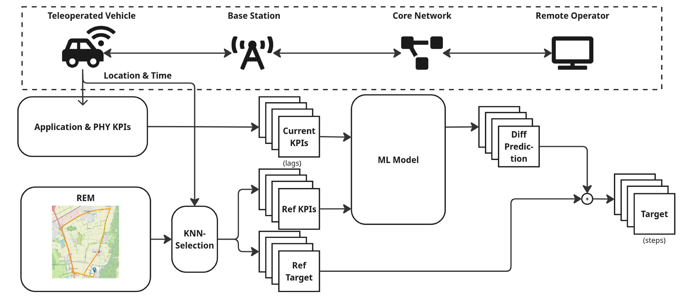

# pQoS
This repository contains the code for predictive quality of service (pQoS) for teleoperation of autonomous vehicle. 

The method aims to predict two important metrics for teleoperation: uplink bandwidth and round-trip time latency.

For documentation of the code, please refer to [documentation](doc/documentation.md)

## Concept

The concept of the pQoS pipeline is to use historically recorder QoS data as anchor points to mitigate the concept drift of the trained machine learning models. The machine learing models are trained to predict the difference between the anchor points and the target values, instead of directly prdicting the target value. 



## Data

## Model

## Usage

### Install

Create a virtual environment with venv

```
python3 -m venv venv

source venv/bin/activate
```

Install dependencies
```
python3 -m pip install -r requirements
```

<!-- ## (Alternative) Pre-built Docker Image -->


TODO: add link to FTM Vehicular Network Data


### Examples

## Licsense

## Citation

The related paper is currently under publication process. A citation will be added here once the publication becomes available.

preprint: TODO


